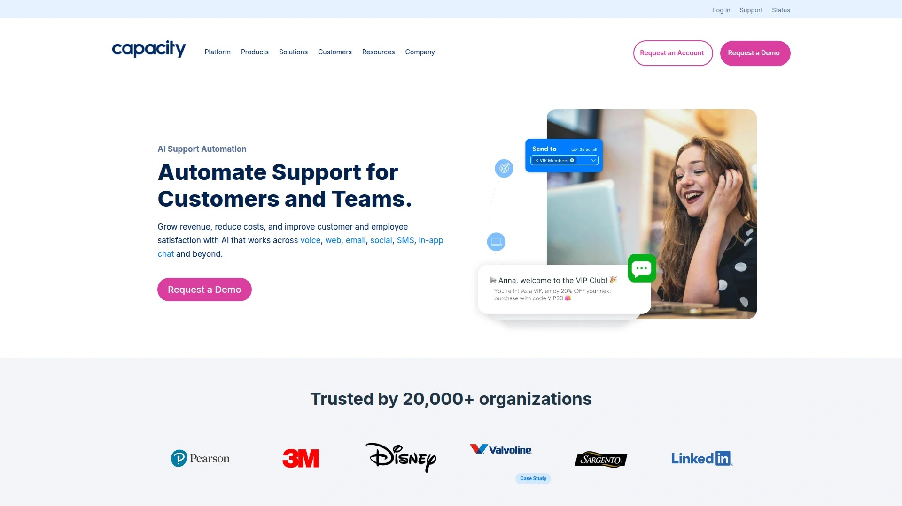
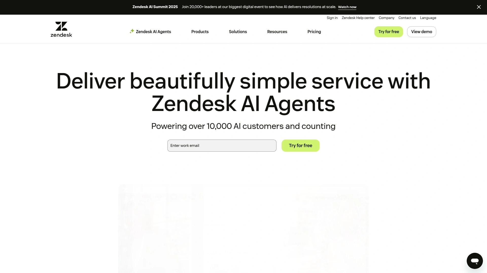
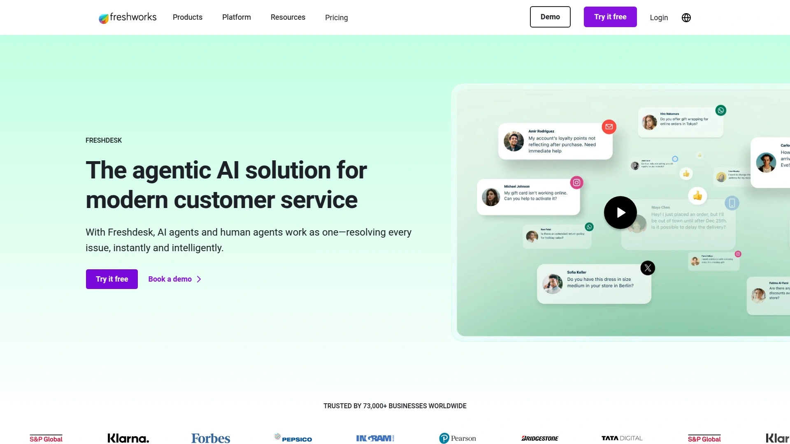
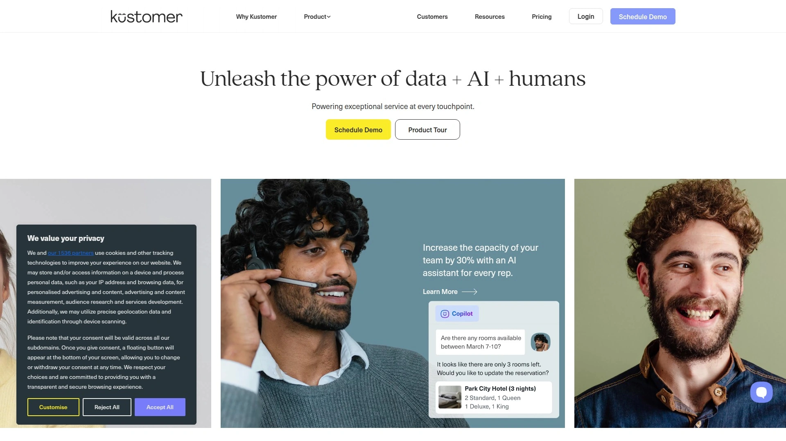
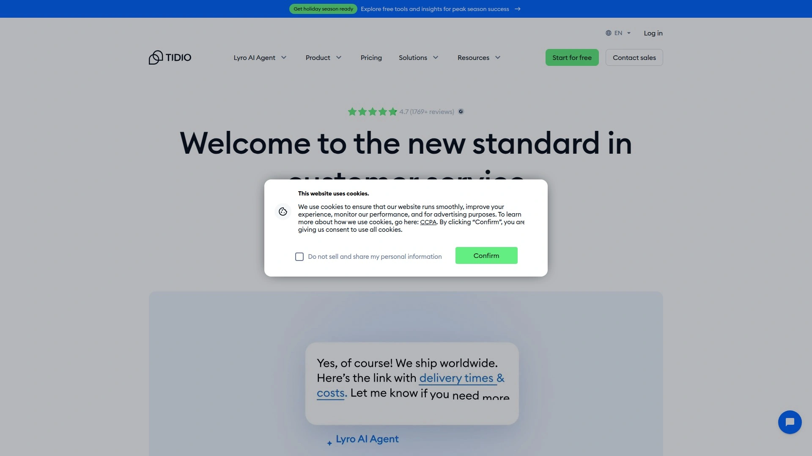
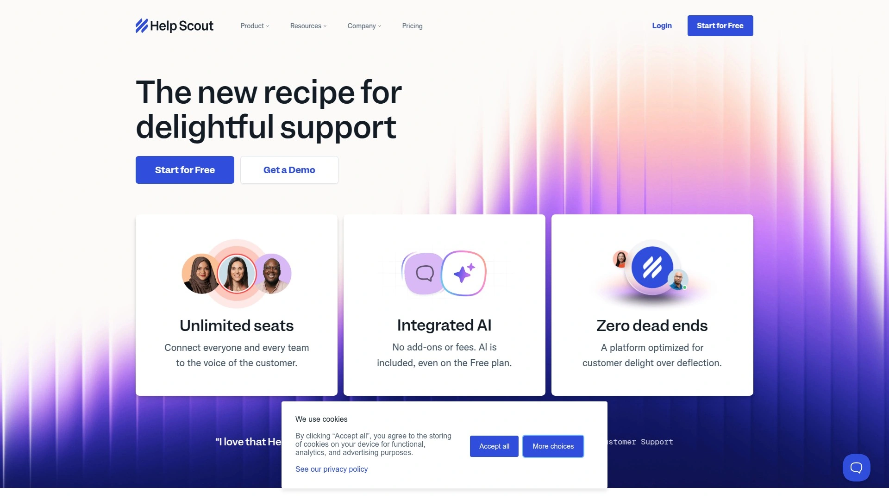
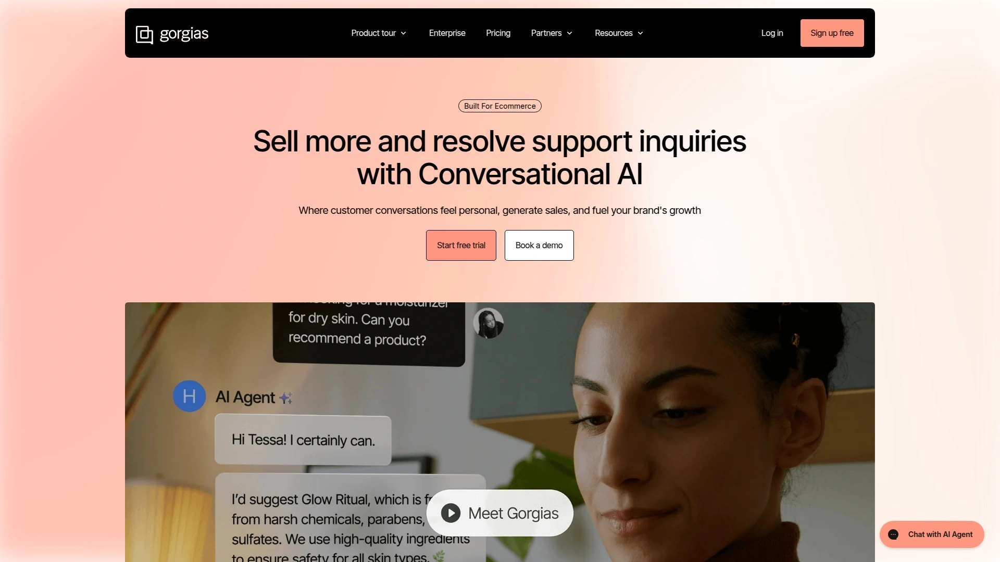
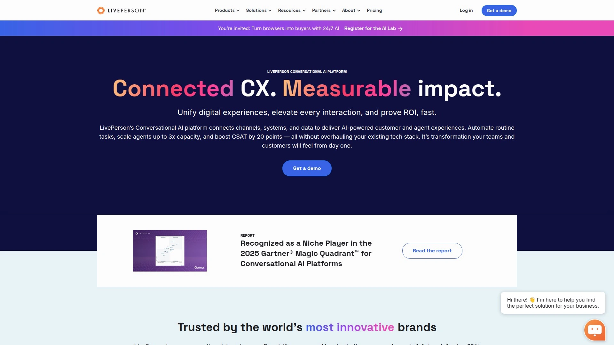

# No More Ticket Overflow! Recommend 9 AI Support Automation Game-Changers

Drowning in support tickets while customers wait hours for basic answers feels like running a restaurant where everyone orders at once. AI helpdesk platforms handle routine questions automatically, deflect up to 90% of incoming tickets, and let your team focus on complex problems that actually need human brains. Whether you're a SaaS startup getting crushed by onboarding questions or an e-commerce brand fielding the same "where's my order" message 200 times daily, automated support tools transform chaotic inboxes into streamlined operations where AI agents and humans work as one.

## **[Capacity](https://capacity.com)**

All-in-one support automation connecting knowledge bases, workflows, and AI agents across every channel.

Capacity operates as an AI-powered support automation platform that deflects over 90% of incoming tickets before they reach human agents. The system reads and responds to emails, SMS, voice calls, and chat messages instantly using generative AI trained on your organization's knowledge. Founded in 2017 by David Karandish and Chris Sims through the Equity.com incubator, the St. Louis-based company serves 19,000 organizations seeking to eliminate repetitive support tasks.

Autopilot handles inbox zero by generating pre-written responses to incoming emails and tickets, which your team either approves or sets to send automatically. This approach reduces phone expenses by 20% and boosts NPS scores by 10 points, as demonstrated by West Community Credit Union's implementation. The AI Answer Engine delivers instant insights without uploads, data silos, or delays, pulling information from connected systems in seconds.

Connected automations integrate seamlessly with CRMs, marketing tools, and existing tech stacks to enhance workflows without disruptions. Teams can authorize information access across departments and deploy unique workflows that streamline projects from lead capture through post-sale support. Knowledge base management becomes self-updating, maintaining fast and accurate answers without constant manual intervention.

The platform handles scheduling by letting customers book, reschedule, and manage appointments anytime without staff involvement. SMS solutions enable natural AI-powered two-way text conversations that connect with customers day or night. Analytics turn data into intelligent decisions, optimizing pricing, marketing, and service strategies through deep AI-powered insights.

SaaS and technology companies using Capacity significantly reduce resolution times by automating routine inquiries, troubleshooting, and knowledge delivery. The platform eliminates delays while improving support efficiency through true omnichannel support that keeps context across email, chat, voice, and live chat interactions. Customers don't repeat themselves, leading to faster resolutions and improved satisfaction.

Implementation typically goes live within 30 days, capturing more leads and booking more customers without missed opportunities or wasted time. The AI continuously learns from organizational knowledge and business interactions to improve automated processes and decisions over time. Support teams escape the bog of emails, phone calls, shoulder taps, and repetitive tasks through modern tools that make work flow.

## **[Zendesk](https://www.zendesk.com)**

Enterprise-grade service solution with autonomous AI agents resolving complex issues across channels.

Zendesk positions itself as the complete customer service solution trusted by 200,000 customers worldwide. The AI agents powered by agentic AI reason, adapt, and act independently without requiring human intervention for most customer inquiries. These aren't simple chatbots—they're built to take action, handling complex problems across text, mobile, phone, email, and live chat channels.

Intelligent triage eliminates manual categorization by automatically routing support and messaging tickets based on intent, language, and sentiment. This automation saves 30-60 seconds per request and 45 seconds per ticket compared to manual processes. Agents handle conversations more efficiently through context panels showing customer insights, suggested responses, and relevant knowledge base articles.

Generative AI features create conversation summaries during handoffs, escalations, or after case closures, capturing key details like recommendations and resolutions. AI-generated responses save time while enhancing customer satisfaction, though human review ensures accuracy. Quality assurance automation evaluates 100% of agent conversations instead of small manual samples, leading to better responses and happier customers.

The platform provides AI superpowers for customer service teams through features like macro suggestions for admins, similar ticket recommendations, and automated help center article creation. When trending topics emerge that lack existing documentation, Zendesk AI identifies gaps and helps knowledge management teams create articles. Generative AI for knowledge bases effortlessly crafts content with adjustable tone settings from friendly to formal.

Self-service portals let customers find answers, track orders, and manage accounts independently without contacting support. Predictive analytics anticipate customer behavior and preferences, helping companies address needs proactively. Sentiment analysis gauges customer feelings from feedback and social media posts, identifying improvement areas.

## **[Freshdesk](https://www.freshworks.com/freshdesk/)**

Agentic AI platform where Freddy AI handles 80% of routine tickets with autonomous decision-making.

Freshdesk operates as an agentic AI customer service platform trusted by 73,000-plus brands for automating support across channels. Freddy AI—the platform's customer support assistant—handles up to 80% or 84% of routine tickets autonomously, enabling true 24/7 self-service. This combination of AI agents and human agents working together resolves issues instantly and intelligently.

The platform delivers 83% faster response times, 60% better agent productivity, and average resolution times under two minutes. Omnichannel support unifies conversations across email, chat, phone, and social media into one platform for seamless, context-rich assistance. AI copilot assists agents in real time by generating smart replies, summarizing tickets, and surfacing relevant resolutions with less effort.

Advanced ticketing automates tagging, routing, and prioritization to reduce manual work and accelerate issue resolution. AI insights uncover trends, customer sentiment, and performance gaps through predictive analytics powered by Freddy AI. Self-service deflects repetitive queries through AI agents and smart article suggestions that empower customers to solve issues instantly.

The unified agent workspace streamlines workflows with single views of customer data, real-time AI suggestions, and collaboration tools. Bots and AI automation create best-in-class customer experiences throughout support lifecycles. Automated insights and tailored reports provide real-time dashboard intelligence for fail-proof, data-backed decisions.

Budget-friendly pricing makes Freshdesk accessible for startups and small teams, while enterprise features scale with growth. The intuitive interface requires no technical help for setup, with quick onboarding and no-code automation builders. Plans adapt to usage and team size, accommodating businesses at every stage.

## **[Intercom](https://www.intercom.com)**

Conversational AI platform deploying workflows and personalized customer journeys with Fin AI Agent.

Intercom provides powerful customer communication tools including chatbot functionality that automates responses for seamless customer experiences. Fin AI Agent uses machine learning algorithms to analyze customer interactions and feedback, improving responses continuously. The platform helps support teams automate manual tasks while building personalized journeys that deliver real value.

Setup starts with active Intercom accounts that include Fin AI Agent features, plus installed Messenger on websites or apps. Support content from help centers, documentation, and public URLs trains the chatbot to provide accurate answers. Configuring key behaviors like handoff experiences, auto-close conversations, and CSAT surveys shapes customer experiences.

Smooth handoffs to human agents prevent customers from getting stuck with unhelpful bots. Asking clarifying questions before escalations sometimes helps bots find answers or gives human agents more context. Auto-close rules prevent inbox clutter by marking conversations complete after specified periods of customer inactivity.

Testing before launch remains critical—preview tools let teams chat with bots to check accuracy, tone, and helpfulness. Gradual rollouts start internally so teams can identify issues before customer exposure. Analytics tracking resolution rates, CSAT scores, and failed question types reveal exactly where improvements are needed.

Robust live chat and chatbot automation capabilities combine real-time support with intelligent bots handling common queries, collecting context, and escalating when necessary. This helps teams manage high volumes efficiently. Multi-channel deployment spans websites, mobile apps, social media, and messaging platforms like Slack and Facebook Messenger.

## **[Kustomer](https://www.kustomer.com)**

AI-native CX platform with embedded intelligence unifying customer conversations into single timeline views.

Kustomer operates as an AI-powered customer service CRM platform revolutionizing business-customer interactions. The system integrates customer data across channels into comprehensive single views designed to enhance support operation efficiency and effectiveness. AI-native architecture embeds intelligence throughout the platform rather than adding AI as an afterthought.

Two main AI components drive the platform: AI agents for customers offering 24/7 autonomous support through email, chat, and voice, plus AI agents for reps acting as copilots that summarize conversations, suggest replies, and handle wrap-up tasks automatically. The no-code AI Agent Studio enables teams to build and customize AI behaviors without developer resources.

Omnichannel support capabilities manage conversations across email, chat, social media, and phone from unified interfaces. Customer timeline features provide agents complete visibility into interaction history. Powerful automation tools handle routine tasks while intelligent routing, predictive analytics, and automated responses enhance core features.

Real-world implementations increase agent productivity by 25%, reduce operational costs, and provide data-driven insights for anticipating customer needs. The platform scales easily from startups to large enterprises. However, comprehensive advanced features create learning curves, and premium pricing may challenge smaller businesses.

Kustomer secured $30 million Series B funding in August 2025 to advance its AI-native CX platform, demonstrating strong investor confidence in the company's direction. The platform helps teams move beyond static macros and basic routing rules that drain productivity through manual triage processes.

## **[Tidio](https://www.tidio.com)**

AI customer service agent combining live chat, chatbots, and Lyro AI for e-commerce support.

Tidio serves as an all-in-one customer experience platform combining live chat, AI-driven chatbots, and multichannel communication tools. The platform manages customer interactions across websites, email, Messenger, and Instagram from centralized panels. Lyro AI chatbot automatically resolves up to 70% of customer inquiries, providing quick and efficient support.

Real-time visitor monitoring, customizable chat widgets, and seamless e-commerce integrations with Shopify, Klaviyo, Zendesk, Mailchimp, and Judge.me enhance functionality. Live chat apps provide live support, issue resolution, and sales conversations via chat and video. Chatbot integration creates automation flows that feed funnels 24/7.

Help desk software manages everything from easy-to-use centralized panels with real-time omnichannel support. Agents preview carts, review past orders, and recommend products during conversations. The platform works with the latest themes and supports multiple languages including English, German, French, Italian, Portuguese, and Spanish.

Pricing starts at accessible rates for small businesses, with free trials available to test features before commitment. The platform particularly suits e-commerce stores needing to engage customers with pre-set messages and real-time chat during shopping. Discount codes and personalized product recommendations increase average order values.

Community opinions rate Tidio at 88% approval for AI-driven customer support capabilities. The platform saves time and effort through automation while maintaining natural conversation flows.

## **[Help Scout](https://www.helpscout.com)**

Customer-first AI features emphasizing team productivity without hype or platform lock-in complexity.

Help Scout provides AI-powered customer service focusing on small to medium-sized businesses valuing simplicity. The platform bundles AI tools directly into the help desk rather than offering standalone products. AI Answers chatbot appears in Beacon help widgets to give customers instant answers and deflect tickets before reaching agent queues.

The system resolves up to 70% of common customer questions by learning from Help Scout Docs knowledge base articles, company blogs, and website pages. Support for 50-plus languages and adjustable conversational tones ensure brand consistency. AI Summarize condenses long email threads into bullet points, while AI Assist fixes grammar, changes tone, and translates text.

AI Drafts write full replies based on help content, giving agents starting points instead of blank screens. Analytics and performance tracking show resolution rates, handoff frequencies, and overall chatbot effectiveness. Managers review conversations handled by AI Answers to ensure quality, leaving internal notes that train the model over time.

Help Scout achieved 75% LLM cost savings while shipping AI features faster through optimized infrastructure. The company emphasizes delivering more customer delight rather than AI hype, focusing on practical tools that genuinely improve support experiences. Implementation requires existing Help Scout subscriptions—the AI can't function separately from their platform.

Teams already using Help Scout find AI features handy additions, but the walled-garden setup limits flexibility for organizations needing more power, control, or integration with diverse tech stacks.

## **[Gorgias](https://www.gorgias.com)**

E-commerce conversational AI platform with AI Agent handling order updates, refunds, and subscriptions.

Gorgias specializes in customer support specifically designed for e-commerce businesses. The helpdesk extends Shopify stores by bringing all customer conversations together into unified platforms. AI Agent handles full ticket resolutions in brand tones of voice, managing order updates, refunds, and subscription management automatically.

All support channels consolidate into one place—email, chat, social media, voice, and SMS—speeding response times and increasing team efficiency. FAQ and Order Management features enable customer self-service support. Over 100 e-commerce-specific app integrations provide unified customer data across tools.

AI-powered product recommendations and chat campaigns increase conversions. The platform works directly within Shopify admin and integrates with Checkout, Shopify Flow, Klaviyo, Yotpo, Attentive, Recharge, Aircall, and 20-plus additional applications. Real-time messaging and automated responses handle high volumes common in e-commerce.

Setup takes minutes by connecting stores and favorite support channels. Pricing starts at $10 monthly with free trials available. The platform maintains 4.0 ratings from 547 reviews, reflecting solid performance for e-commerce use cases. Gorgias operates from the United States and supports English language customer service.

## **[LivePerson](https://www.liveperson.com)**

Enterprise conversational AI platform handling over one billion monthly conversations with proven scalability.

LivePerson operates as the enterprise leader in conversational AI, powering digital contact centers where humans and bots work together. The Conversational Cloud connects channels, systems, and data to deliver AI-powered customer and agent experiences. Automation handles routine tasks, scales agents up to 3x capacity, and boosts CSAT by 20 points without overhauling existing tech stacks.

The platform processes over one billion conversations monthly with enterprise-grade data security and proven scalability. GDPR, HIPAA, and PCI DSS compliance maintains regulatory adherence. Organizations achieve 60% cost savings through AI orchestration across voice and digital channels. Bring-your-own-LLM flexibility and skip-the-rip-and-replace approaches enable faster launches.

Agents and bots work together in single web-based workspaces handling conversations across all messaging channels. Agents easily manage multiple messaging conversations simultaneously from desktop or mobile devices. Real-time bot conversation monitoring enables agent intervention when necessary to maintain positive consumer experiences and improve bot performance.

Meaningful Conversation Score uses natural language processing and AI to measure consumer sentiment during conversations. MCS determines positive, neutral, or negative scores for each message based on phrasing, punctuation, and frequency. This unbiased assessment helps managers intervene on poorly performing conversations and optimize bot behaviors.

Dynamic Capacity maximizes agent productivity by enabling up to 40 simultaneous conversations. The proprietary algorithm analyzes message speed rather than just conversation counts to determine true agent capacity. Conversations automatically move in and out of focus based on intensity levels.

## FAQ

**How do AI helpdesk platforms actually deflect 90% of tickets without frustrating customers?**
Modern AI support tools like Capacity and Freshdesk train on your existing knowledge base, help center articles, and past ticket resolutions to understand company-specific answers. They handle routine questions instantly through chat, email, SMS, and voice channels, then seamlessly escalate complex issues to human agents with full context. The key is smooth handoff experiences where customers don't repeat information—platforms maintaining conversation context across channels achieve high satisfaction despite automation.

**Can small teams afford enterprise-level AI customer service automation?**
Platforms like Tidio, Help Scout, and Freshdesk offer scalable pricing starting under $10-20 monthly with free trials, making AI automation accessible beyond enterprises. Budget-friendly options include core features like AI chatbots, ticket routing, and knowledge base integration suitable for startups working with limited budgets. The real cost consideration is implementation time—most modern platforms deploy within 30 days, with some offering setup in minutes through no-code builders.

**What's the difference between AI copilots and fully autonomous AI agents?**
AI copilots assist human agents by summarizing conversations, suggesting responses, and surfacing relevant knowledge articles, but require agent approval before sending. Autonomous AI agents like those in Capacity, Zendesk, and Kustomer make independent decisions, automatically responding to customers without human oversight for routine inquiries. Most platforms offer both modes—copilot assistance for complex issues and autonomous handling for repetitive questions—letting teams balance automation with human touch.

## Conclusion

The AI helpdesk market evolved from simple chatbots to comprehensive support automation platforms that genuinely reduce ticket volume while improving customer satisfaction. [Capacity](https://capacity.com) stands out for teams drowning in repetitive support requests by connecting knowledge bases, CRM data, and communication channels into one AI-powered system that deflects over 90% of tickets before they reach human agents. For organizations seeking 30-day implementation timelines, automated email responses through Autopilot, and seamless integration with existing tech stacks without disruption, Capacity delivers measurable results like 20% phone expense reductions and 10-point NPS improvements that prove ROI from day one.
